# Code Sharing Platform - Architecture Overview

## System Architecture

The Code Sharing Platform is a real-time collaborative code editor built with a modern, layered architecture:

### Technology Stack

**Frontend:**
- React 18 with TypeScript
- Vite (build tool)
- Redux (state management)
- Redux-Saga (side effects)
- WebSocket (real-time collaboration) - SockJS/STOMP
- Nginx (reverse proxy with SSL/TLS)

**Backend:**
- Spring Boot (Java 21)
- GraphQL API (code-first)
- WebSocket over STOMP (real-time messaging)
- Spring Security

**Databases:**
- **PostgreSQL** - User management, tiny URL mappings, persistent data
- **MongoDB** - Code snippets, collaboration state, tags

**Infrastructure:**
- Docker Compose (containerization)
- HTTPS/SSL certificates (self-signed for development)

---

## Core Components

### Frontend Architecture

```
HomePage
  ├─ Snippet Search & Browse
  ├─ Create New Snippet Flow
  └─ Username Management

EditorPage
  ├─ Code Editor (react-simple-code-editor)
  ├─ Metadata Sidebar
  ├─ Active Users Panel
  └─ Real-time Collaboration

WebSocket Integration
  ├─ Presence Updates
  ├─ Code Changes
  ├─ Metadata Updates
  ├─ Typing Indicators
  └─ User Sessions

Redux Store
  ├─ Snippet State (items, current, loading)
  ├─ Comments State
  └─ UI State
```

### Backend Architecture

```
API Layer (GraphQL + REST)
  ├─ SnippetController (GraphQL)
  ├─ UserController (GraphQL)
  └─ SnippetSharingController (REST)

WebSocket Layer
  ├─ CollaborationController
  ├─ PresenceManager
  └─ CollaborationService

Service Layer
  ├─ SnippetService
  ├─ UserService
  ├─ CollaborationService
  └─ TinyURLService

Repository Layer
  ├─ MongoDB (CodeSnippetRepository)
  ├─ PostgreSQL (UserRepository, TinyUrlRepository)
  └─ Data Access Objects
```

---

## Data Models

### MongoDB Collections

#### CodeSnippet
```javascript
{
  _id: ObjectId,                    // MongoDB ID
  id: String,                       // Unique snippet ID (UUID)
  title: String,                    // Snippet title
  description: String,              // Description
  code: String,                     // Source code content
  language: String,                 // Programming language
  authorId: String,                 // Creator's user ID
  authorUsername: String,           // Creator's username
  tags: [String],                   // Topic tags
  views: Number,                    // View count
  isPublic: Boolean,                // Visibility flag
  shareUrl: String,                 // Share URL (optional)
  createdAt: Date,                  // Creation timestamp
  updatedAt: Date,                  // Last update timestamp
  __v: Number                       // Version field
}
```

**Indexes:**
- `_id` (primary)
- `id` (unique)
- `authorId` (for user's snippets)
- `language` (for language-based queries)
- `tags` (for tag searches)
- `createdAt` (for sorting)

#### CollaborationSession (transient, in-memory)
```javascript
{
  snippetId: String,
  activeUsers: [
    {
      userId: String,
      username: String,
      joinedAt: Date,
      owner: Boolean
    }
  ],
  currentCode: String,
  currentMetadata: {
    title: String,
    description: String,
    language: String,
    tags: [String]
  }
}
```

### PostgreSQL Tables

#### Users
```sql
CREATE TABLE users (
  id VARCHAR(36) PRIMARY KEY,
  username VARCHAR(255) NOT NULL,
  email VARCHAR(255),
  created_at TIMESTAMP DEFAULT CURRENT_TIMESTAMP,
  updated_at TIMESTAMP DEFAULT CURRENT_TIMESTAMP
);
```

**Indexes:**
- `email` (unique)
- `username`

#### TinyURLs
```sql
CREATE TABLE tiny_urls (
  id VARCHAR(36) PRIMARY KEY,
  short_code VARCHAR(20) UNIQUE NOT NULL,
  snippet_id VARCHAR(36) NOT NULL,
  user_id VARCHAR(36),
  created_at TIMESTAMP DEFAULT CURRENT_TIMESTAMP,
  expires_at TIMESTAMP,
  FOREIGN KEY (user_id) REFERENCES users(id)
);
```

**Indexes:**
- `short_code` (unique)
- `snippet_id`
- `user_id`
- `created_at`

---

## Key Flows

### 1. Create New Snippet & Share


### 2. Join Existing Session


### 3. Real-Time Code Collaboration


### 4. Metadata Synchronization (Owner → Joinee)


### 5. Presence & Active Users

```mermaid
sequenceDiagram
    participant User1 as User 1<br/>(Owner)
    participant WS1 as WebSocket
    participant Backend as Backend<br/>CollaborationService
    participant WS2 as WebSocket
    participant User2 as User 2<br/>(Joinee)

    User1->>WS1: Join snippet
    WS1->>Backend: handleUserJoin(snippetId, userId, username)
    Backend->>Backend: Register user in active session
    Backend->>WS1: Broadcast presence: user_joined
    WS1->>User1: Receive active users list
    User1->>User1: Update UI with active users

    User2->>WS2: Join same snippet
    WS2->>Backend: handleUserJoin(snippetId, userId, username)
    Backend->>Backend: Add User2 to active users
    Backend->>WS2: Broadcast presence: user_joined
    
    WS2->>User2: Send active users list (includes User1 with owner badge)
    WS1->>User1: Send updated active users (includes User2)
    
    User2->>User2: Show: User1 is owner (crown badge 👑)
    User1->>User1: Show: User2 joined (notification)
```



### 6. Typing Indicators


---

## WebSocket Message Types

### 1. Presence Message
```json
{
  "type": "user_joined|user_left",
  "userId": "user_123",
  "username": "John",
  "activeUsers": [
    {
      "userId": "user_123",
      "username": "John",
      "joinedAt": "2025-12-24T10:00:00Z",
      "owner": true
    },
    {
      "userId": "user_456",
      "username": "Jane",
      "joinedAt": "2025-12-24T10:05:00Z",
      "owner": false
    }
  ],
  "snippetTitle": "My Code",
  "ownerTitle": "My Code",
  "ownerDescription": "A working solution",
  "ownerLanguage": "javascript",
  "ownerTags": ["javascript", "solution"]
}
```

### 2. Code Change Message
```json
{
  "userId": "user_123",
  "username": "John",
  "code": "function hello() { ... }",
  "language": "javascript",
  "timestamp": 1703424000000
}
```

### 3. Metadata Update Message
```json
{
  "userId": "user_123",
  "title": "Updated Title",
  "description": "Updated description",
  "language": "python",
  "tags": ["python", "updated"],
  "timestamp": 1703424000000
}
```

### 4. Typing Indicator Message
```json
{
  "userId": "user_123",
  "isTyping": true,
  "timestamp": 1703424000000
}
```

### 5. Typing Status Message (aggregated)
```json
{
  "typingUsers": [
    {
      "userId": "user_123",
      "username": "John"
    }
  ]
}
```

---

## Database Storage Details

### MongoDB - What Gets Stored

**Primary Collection: CodeSnippet**
- All user-created code snippets
- Metadata: title, description, language, tags
- Ownership: authorId, authorUsername
- Lifecycle: createdAt, updatedAt
- Engagement: views count
- Visibility: isPublic flag

**Storage Pattern:**
- One document per snippet
- Embedded arrays for tags
- Timestamps for tracking
- Language for syntax highlighting

### PostgreSQL - What Gets Stored

**TinyURLs Table:**
- Mapping between short codes and snippet IDs
- Creator information (userId)
- Expiration dates for share links
- Timestamps for audit trails

**Users Table (optional):**
- User profiles (if persistent authentication added)
- User metadata

**Storage Pattern:**
- Relational structure for integrity
- Foreign keys for data consistency
- Indexes for fast lookups

---

## Session Lifecycle

### New Snippet Flow
1. Owner creates snippet at `/start/new-snippet-ABC`
2. Snippet exists only in memory (browser state)
3. Joinee can join and collaborate
4. Owner clicks Save → Create mutation sent to backend
5. Backend creates MongoDB document
6. Snippet gets permanent ID
7. TinyURL mapping created in PostgreSQL
8. Future access uses permanent ID

### Existing Snippet Flow
1. User opens snippet via tiny code
2. EditorPage resolves tiny code to snippet ID
3. GraphQL query fetches from MongoDB
4. Both owner and joinee can collaborate
5. Save updates MongoDB document
6. TinyURL in PostgreSQL remains unchanged

---

## Authentication & Authorization

### Current Implementation
- Session-based user identification (sessionUserId)
- Persistent user ID (persistentUserId) for owners
- Username from localStorage
- No password authentication

### Owner Detection
1. **New Snippet Creation** (Priority 1)
   - Owner is the one who created the session
   - Identified via `/start/` route
   - persistentUserId reused

2. **Existing Snippet** (Priority 2)
   - Owner is the original authorId
   - Retrieved from MongoDB
   - Verified via ownership check

3. **Active Users** (Priority 3)
   - Owner marked in presence message
   - First user to join = owner

---

## Performance Considerations

### Real-Time Updates
- WebSocket for instant synchronization
- Debounced code changes (prevents flooding)
- Presence updates throttled
- Typing indicators debounced

### Database Queries
- Indexed searches by language, tags, authorId
- Pagination for snippet lists
- TinyURL lookup optimized

### Frontend State Management
- Redux for centralized state
- Sagas for async operations
- Component memoization for rendering

---

## Error Handling

### WebSocket Failures
- Auto-reconnection with exponential backoff
- Graceful degradation
- User notifications for connection issues

### Snippet Operations
- GraphQL error responses
- User-friendly error messages
- Fallback to read-only mode if offline

### Data Consistency
- Optimistic updates for better UX
- Backend validation before persistence
- Conflict resolution for concurrent edits

