```mermaid
sequenceDiagram
    participant Owner
    participant OwnerEditor as Owner<br/>EditorPage
    participant WebSocket
    participant Backend
    participant Joinee
    participant JoineeEditor as Joinee<br/>EditorPage
    participant JoineeUI as Joinee's<br/>Metadata Panel

    Owner->>OwnerEditor: Click on title field
    OwnerEditor->>OwnerEditor: Show editable title input
    
    Owner->>OwnerEditor: Change title: "Hello World" → "Hello Python"
    activate OwnerEditor
    OwnerEditor->>OwnerEditor: Trigger onChange event
    OwnerEditor->>OwnerEditor: Update formData.title
    OwnerEditor->>OwnerEditor: Check if isOwner
    
    Note over OwnerEditor: isOwner = true<br/>so send update
    
    OwnerEditor->>OwnerEditor: Build MetadataUpdateMessage:
    Note over OwnerEditor: {<br/>  userId: "owner_123",<br/>  title: "Hello Python",<br/>  timestamp: now<br/>}
    
    OwnerEditor->>WebSocket: Send to /app/snippet/{id}/metadata
    deactivate OwnerEditor
    
    activate WebSocket
    WebSocket->>Backend: Route metadata message
    activate Backend
    Backend->>WebSocket: Convert and send to /topic/snippet/{id}/metadata
    deactivate Backend
    deactivate WebSocket
    
    activate WebSocket
    WebSocket->>JoineeEditor: Broadcast MetadataUpdateMessage
    WebSocket->>OwnerEditor: Echo back to owner
    deactivate WebSocket
    
    activate JoineeEditor
    JoineeEditor->>JoineeEditor: Receive metadata update
    JoineeEditor->>JoineeEditor: Extract: { userId, title, description... }
    JoineeEditor->>JoineeEditor: Check: userId !== currentUserId?
    
    Note over JoineeEditor: Update is from owner,<br/>not from self
    
    JoineeEditor->>JoineeEditor: Update formData.title = "Hello Python"
    JoineeEditor->>JoineeEditor: Dispatch Redux action: SNIPPET_SET_TITLE_FROM_OWNER
    JoineeEditor->>JoineeEditor: Trigger re-render
    JoineeEditor->>JoineeUI: Display updated title
    deactivate JoineeEditor
    
    Joinee->>JoineeUI: See title changed to "Hello Python"
    
    Owner->>OwnerEditor: Add tag: "python"
    activate OwnerEditor
    OwnerEditor->>OwnerEditor: Update formData.tags
    OwnerEditor->>OwnerEditor: Check isOwner
    
    OwnerEditor->>OwnerEditor: Build MetadataUpdateMessage:
    Note over OwnerEditor: {<br/>  userId: "owner_123",<br/>  tags: ["python"],<br/>  timestamp: now<br/>}
    
    OwnerEditor->>WebSocket: Send metadata update
    deactivate OwnerEditor
    
    activate WebSocket
    WebSocket->>JoineeEditor: Broadcast tag update
    deactivate WebSocket
    
    activate JoineeEditor
    JoineeEditor->>JoineeEditor: Receive metadata update
    JoineeEditor->>JoineeEditor: Update formData.tags = ["python"]
    JoineeEditor->>JoineeUI: Display new tags
    deactivate JoineeEditor
    
    Joinee->>JoineeUI: See tags updated to "python"
```

# Code Sharing Platform - Use Cases & Sequence Diagrams

## Use Case 1: Owner Creates New Snippet and Shares

### Description
An owner creates a new code snippet, sets metadata (title, description, language, tags), and generates a shareable link for collaboration.

### Actors
- Owner (snippet creator)

### Preconditions
- User is on the home page
- Has not created a snippet yet

### Main Flow

```mermaid
sequenceDiagram
    actor Owner
    participant HomePage
    participant EditorPage
    participant Browser Storage as Browser<br/>Storage
    participant WebSocket
    participant Backend
    participant MongoDB
    participant PostgreSQL

    Owner->>HomePage: Click "Create New Snippet"
    activate HomePage
    HomePage->>Owner: Show username dialog
    Owner->>HomePage: Enter username (e.g., "John")
    HomePage->>Browser Storage: localStorage.setItem("currentUsername", "John")
    HomePage->>Browser Storage: Generate/retrieve persistentUserId
    
    Note over HomePage: Generate tiny code<br/>new-snippet-ABC123
    HomePage->>Browser Storage: Store creator info
    HomePage->>EditorPage: navigate(/start/new-snippet-ABC123)
    deactivate HomePage
    
    activate EditorPage
    EditorPage->>EditorPage: Parse URL path
    EditorPage->>EditorPage: Detect /start route → isOwner = true
    EditorPage->>EditorPage: Set snippetOwnerId = persistentUserId
    EditorPage->>EditorPage: Show metadata sidebar (left panel)
    EditorPage->>EditorPage: Show Share & Save buttons
    
    Owner->>EditorPage: Enter title: "Hello World Function"
    Owner->>EditorPage: Enter description: "A simple greeting"
    Owner->>EditorPage: Select language: "javascript"
    Owner->>EditorPage: Add tags: "javascript", "hello"
    Owner->>EditorPage: Type code in editor
    
    EditorPage->>WebSocket: Connect to WebSocket
    WebSocket->>Backend: /app/snippet/new-snippet-ABC123/join
    Backend->>Backend: Register owner in active session
    Backend->>WebSocket: Broadcast presence update
    WebSocket->>EditorPage: Send presence acknowledgement
    
    Owner->>EditorPage: Click "Share"
    EditorPage->>Owner: Display share URL: http://localhost/join/new-snippet-ABC123
    
    Owner->>EditorPage: Click "Save"
    EditorPage->>EditorPage: Validate title & code not empty
    EditorPage->>Backend: Send GraphQL CreateSnippet mutation
    activate Backend
    Backend->>MongoDB: Save CodeSnippet document
    MongoDB->>MongoDB: Generate UUID as snippet ID
    MongoDB->>Backend: Return saved snippet
    Backend->>PostgreSQL: Create TinyURL mapping (ABC123 → snippetId)
    PostgreSQL->>Backend: Confirm mapping created
    Backend->>EditorPage: Return created snippet with ID
    deactivate Backend
    
    EditorPage->>EditorPage: Update resolvedSnippetId with new ID
    EditorPage->>Browser Storage: Update snippet reference
    EditorPage->>EditorPage: Show success message
    EditorPage->>EditorPage: Redirect to home after 1.5s
    
    deactivate EditorPage
```

### Postconditions
- Snippet is saved to MongoDB with owner's userId as authorId
- TinyURL mapping exists in PostgreSQL
- Share URL is valid and can be used by others
- Owner can see snippet in their session

---

## Use Case 2: Joinee Joins Existing Collaboration Session

### Description
A joinee opens a shared snippet link and joins an active collaboration session with the owner.

### Actors
- Joinee (collaborator joining session)
- Owner (already in session)

### Preconditions
- Owner has shared a snippet with a valid tiny code
- Owner may or may not have saved the snippet yet

### Main Flow


### Postconditions
- Joinee is now part of the active session
- Joinee can see owner's current code and metadata
- Owner is notified of joinee's presence
- Both are subscribed to real-time updates
- Metadata sidebar is read-only for joinee

---

## Use Case 3: Real-Time Code Synchronization

### Description
Both owner and joinee edit code in real-time, with changes synchronized instantly via WebSocket.

### Actors
- Owner
- Joinee

### Preconditions
- Both are in active session
- WebSocket connections established
- They are subscribed to code change messages

### Main Flow


### Postconditions
- Both users see synchronized code
- Changes are persisted in local state
- Display is kept up-to-date
- Code is not saved to database (only on explicit Save)

---

## Use Case 4: Owner Updates Metadata and Syncs to Joinee

### Description
Owner edits metadata (title, description, language, tags) and joinee receives real-time updates.

### Actors
- Owner
- Joinee

### Preconditions
- Both in active session
- Metadata subscriptions established
- Owner has write access to metadata

### Main Flow



### Postconditions
- Joinee sees all metadata changes in real-time
- Metadata is displayed as read-only to joinee
- Owner's changes persist in local state
- Changes are not saved to database until Save clicked

---

## Use Case 5: Save Snippet to Database

### Description
Owner saves the snippet, storing all data (code + metadata) to MongoDB and creating/updating TinyURL in PostgreSQL.

### Actors
- Owner

### Preconditions
- Snippet is being edited
- Title and code are not empty
- Owner has write permissions

### Main Flow

```mermaid
sequenceDiagram
    participant Owner
    participant EditorPage
    participant Frontend Store as Frontend<br/>Redux Store
    participant Backend Service as Backend<br/>Service Layer
    participant MongoDB
    participant PostgreSQL
    participant DB Response

    Owner->>EditorPage: Click "Save"
    activate EditorPage
    EditorPage->>EditorPage: Validate title not empty
    EditorPage->>EditorPage: Validate code not empty
    
    alt Validation fails
        EditorPage->>Owner: Show error message
        Note over EditorPage: Validation failed!
    else Validation succeeds
        EditorPage->>EditorPage: Set isSaving = true
        EditorPage->>EditorPage: Show saving indicator
        
        alt New snippet (isNew = true)
            EditorPage->>EditorPage: Create SNIPPET_CREATE_REQUEST action
            Note over EditorPage: Include:<br/>- authorId (userId)<br/>- title, description, code<br/>- language, tags<br/>- isPublic
        else Existing snippet
            EditorPage->>EditorPage: Create SNIPPET_UPDATE_REQUEST action
            Note over EditorPage: Include:<br/>- id (snippetId)<br/>- title, description, code<br/>- language, tags
        end
        
        EditorPage->>Frontend Store: Dispatch action
        activate Frontend Store
        Frontend Store->>Frontend Store: Route to snippet saga
        
        alt Create new
            Frontend Store->>Backend Service: GraphQL: createSnippet mutation
        else Update existing
            Frontend Store->>Backend Service: GraphQL: updateSnippet mutation
        end
        
        deactivate Frontend Store
        
        activate Backend Service
        Backend Service->>MongoDB: Save/Update CodeSnippet document
        activate MongoDB
        
        alt New snippet
            MongoDB->>MongoDB: Generate UUID as snippet.id
            MongoDB->>MongoDB: Set authorId, authorUsername
            MongoDB->>MongoDB: Set timestamps (createdAt, updatedAt)
            MongoDB->>DB Response: Return saved document
        else Existing snippet
            MongoDB->>MongoDB: Update existing document
            MongoDB->>MongoDB: Update updatedAt timestamp
            MongoDB->>DB Response: Return updated document
        end
        
        deactivate MongoDB
        
        Backend Service->>PostgreSQL: Create/Update TinyURL mapping
        activate PostgreSQL
        PostgreSQL->>PostgreSQL: Map shortCode → snippetId
        PostgreSQL->>DB Response: Confirm mapping
        deactivate PostgreSQL
        
        Backend Service->>EditorPage: Return saved snippet with new ID
        deactivate Backend Service
        
        EditorPage->>EditorPage: Update resolvedSnippetId
        EditorPage->>EditorPage: Update Redux store
        EditorPage->>EditorPage: Set isSaving = false
        EditorPage->>Owner: Show success message
        EditorPage->>Owner: Show "Saved successfully"
        
        EditorPage->>EditorPage: Schedule redirect to home
        EditorPage->>EditorPage: setTimeout(1500ms)
        EditorPage->>EditorPage: navigate('/')
    end
    
    deactivate EditorPage
```

### Postconditions
- Snippet is permanently stored in MongoDB
- TinyURL mapping is created in PostgreSQL
- Snippet has a permanent ID
- Share URL is now persistently valid
- Owner can leave and rejoin using snippet ID

---

## Use Case 6: Typing Indicators

### Description
Users see real-time typing indicators showing who is currently editing.

### Actors
- Owner
- Joinee

### Preconditions
- Both in active session
- Typing indicator subscriptions established

### Main Flow


### Postconditions
- Typing indicators are accurate
- Users know who is currently editing
- Indicators clear after 2-second inactivity
- No database persistence for typing data

---

## Use Case 7: User Leaves Session

### Description
A user leaves the collaboration session, triggering cleanup and notifications.

### Actors
- Leaver (owner or joinee)
- Remaining participants

### Preconditions
- User is in active session
- Other participants may be present

### Main Flow


### Postconditions
- User is removed from active session
- Remaining users are notified
- Subscriptions are cleaned up
- Session continues if other users remain

---

## Data Flow Diagrams

### Frontend → Backend Data Flow


### Real-Time Synchronization Flow


---

## Message Sequence Summary

| Message Type | Sender | Receiver | Topic | Frequency |
|---|---|---|---|---|
| Presence | Backend | All users | `/topic/snippet/{id}/presence` | On join/leave |
| Code Change | User | All users | `/topic/snippet/{id}/code` | Per keystroke (debounced) |
| Metadata Update | Owner | All users | `/topic/snippet/{id}/metadata` | Per change |
| Typing Indicator | User | Backend | `/app/snippet/{id}/typing` | Per keystroke |
| Typing Status | Backend | All users | `/topic/snippet/{id}/typing-status` | Per typing change |

